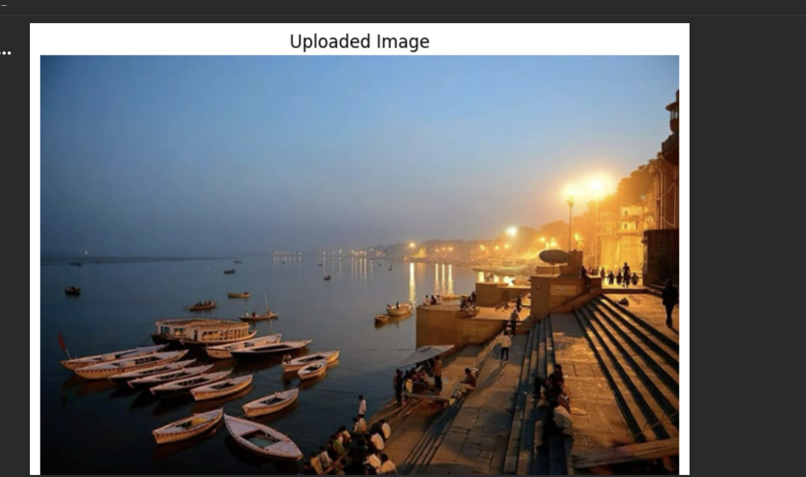
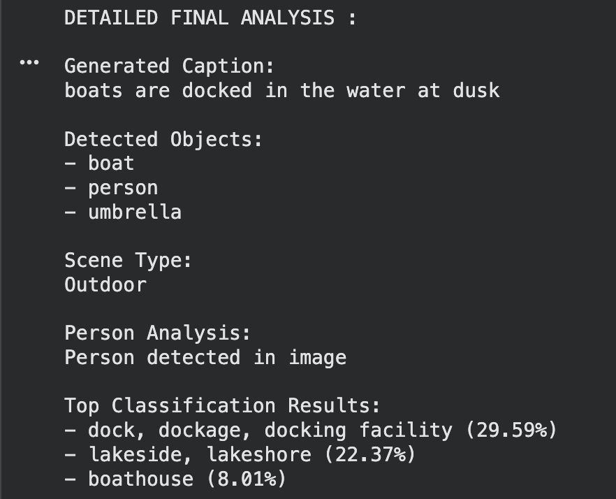

# 🖼️ End-to-End Image Understanding System

An AI pipeline that performs **multi-task image analysis** using three 
pre-trained deep learning models — ViT, DETR, and BLIP — integrated 
via HuggingFace Transformers.

## 🔍 What It Does

Given any input image, the system automatically produces:

| Task | Model Used | Output |
|------|-----------|--------|
| Image Classification | ViT (google/vit-base-patch16-224) | Top-5 labels with confidence scores |
| Object Detection | DETR (facebook/detr-resnet-50) | Detected objects above 60% threshold |
| Image Captioning | BLIP (Salesforce/blip-image-captioning-base) | Natural language description |
| Scene Analysis | Rule-based (keyword matching) | Indoor / Outdoor / Mixed |

## 📸 Sample Output

**Input:** Varanasi Ghat at dusk

**Output:**
- 📝 Caption: *"boats are docked in the water at dusk"*
- 🎯 Detected Objects: boat, person, umbrella
- 🌅 Scene Type: Outdoor
- 🏷️ Top Classifications: dock/dockage (29.59%), lakeside (22.37%), boathouse (8.01%)

## 🛠️ Tech Stack

- Python, PyTorch
- HuggingFace Transformers
- ViT, DETR, BLIP
- PIL, Matplotlib
- Google Colab (GPU/CPU dynamic detection)

## 🚀 How to Run

1. Open the notebook in Google Colab
2. Run all cells in order
3. Upload any image when prompted
4. View the full analysis output

## ⚠️ Known Limitations

- Scene analysis is rule-based (keyword matching), not model-driven
- Object detection limited to COCO dataset's 80 classes
- Runs on CPU if GPU unavailable — slower inference
## 📁 Repository Structure
